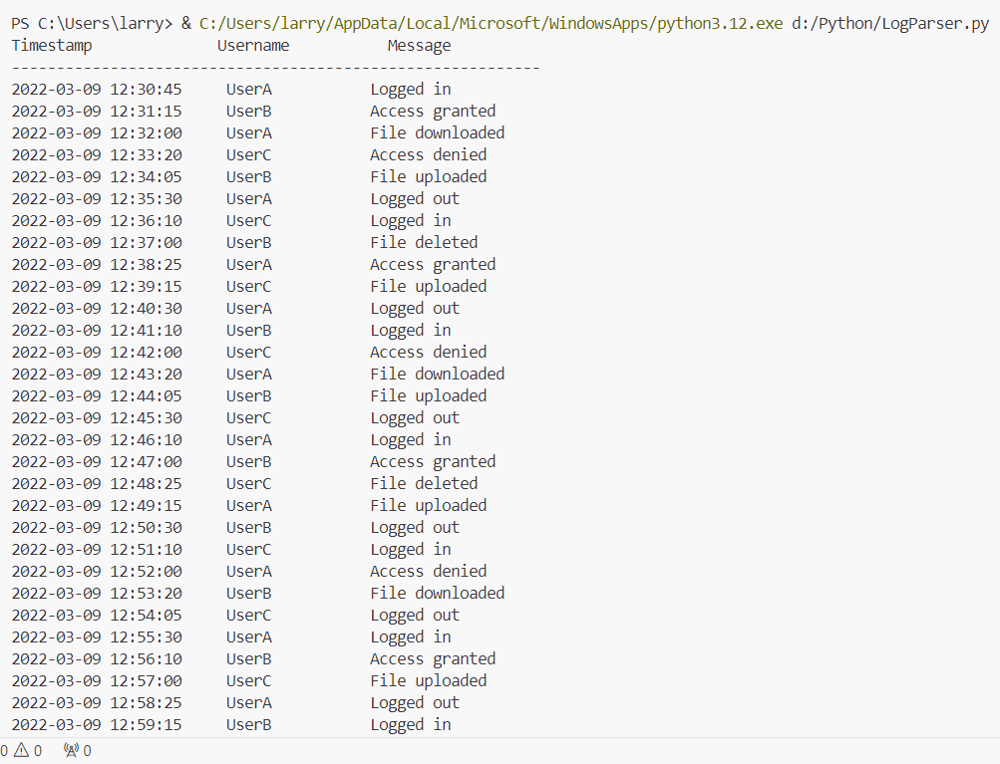
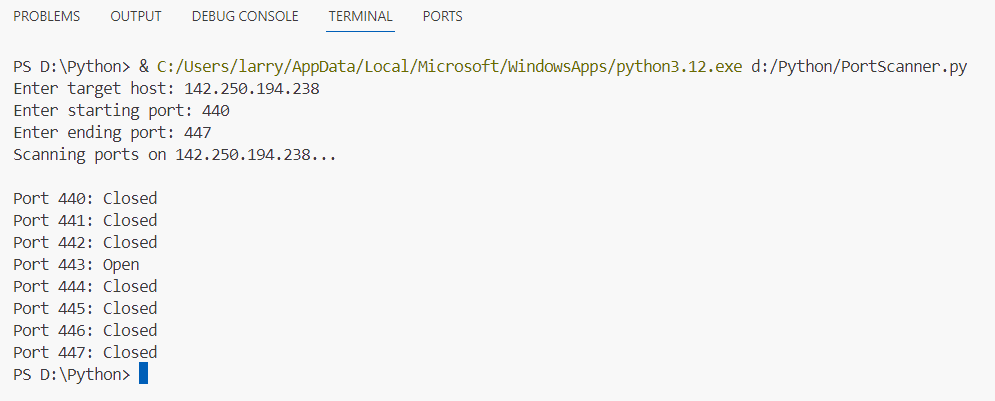
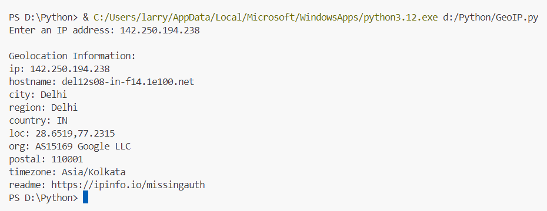
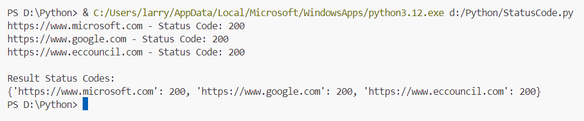
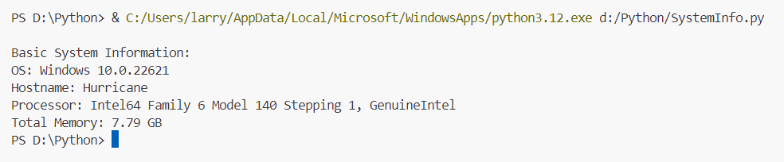
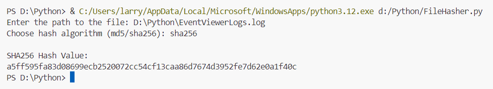
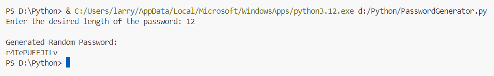

# Python Security & Automation Scripting Toolkit

A suite of 8 lightweight Python utilities demonstrating administrative automation, network reconnaissance, log parsing, file integrity hashing, and system auditing.

---

## Overview

Security engineers and SOC analysts frequently rely on rapid, modular Python scripts to parse logs, verify service reachability, generate cryptographic hashes, and query external intelligence APIs. 

This repository consolidates 8 functional administrative and reconnaissance scripts designed for day-to-day security operations, network diagnostics, and endpoint auditing.

---

## Script Inventory

| Script | Primary Modules | Functionality & Practical Use Case |
| :--- | :--- | :--- |
| **[LogParser.py](./LogParser.py)** | `re`, `sys`, `os` | Parses structured syslog/application event logs, extracting timestamps, usernames, and messages into tabular reports. |
| **[PortScanner.py](./PortScanner.py)** | `socket` | Multi-threaded TCP connect scanner verifying open listening ports across designated IP addresses. |
| **[GeoIP.py](./GeoIP.py)** | `requests` | Queries the IPInfo geolocation API to resolve external IP addresses to city, region, country, and ASN coordinates. |
| **[StatusCode.py](./StatusCode.py)** | `requests` | Verifies web endpoint reachability and returns HTTP status codes (200, 301, 403, 404, 500). |
| **[FileHasher.py](./FileHasher.py)** | `hashlib` | Generates MD5 and SHA-256 cryptographic hashes for specified files to verify integrity and check IOCs. |
| **[SystemInfo.py](./SystemInfo.py)** | `platform`, `os` | Audits endpoint system architecture, OS release version, hostname, and processor environment. |
| **[PasswordGenerator.py](./PasswordGenerator.py)** | `random`, `string` | Dynamically generates cryptographically diverse passwords with configurable character sets. |
| **[MailClient.py](./MailClient.py)** | `smtplib` | Lightweight SMTP automation script for forwarding security notifications and alerts. |

---

## Tool Demonstrations & Outputs

### 1. LogParser.py
Parses log lines matching standard timestamp-user patterns into structured tables:
<p align="center">
  
</p>

### 2. PortScanner.py
Scans target IP addresses for open TCP socket ports:
<p align="center">
  
</p>

### 3. GeoIP.py
Retrieves IP geolocation metadata from IPInfo:
<p align="center">
  
</p>

### 4. StatusCode.py
Tests HTTP response codes for web service availability:
<p align="center">
  
</p>

### 5. SystemInfo.py
Extracts operating system and host environment details:
<p align="center">
  
</p>

### 6. FileHasher.py
Computes SHA-256 and MD5 checksums for file integrity verification:
<p align="center">
  
</p>

### 7. PasswordGenerator.py
Generates high-entropy random passwords:
<p align="center">
  
</p>

---

## Setup & Execution

### Prerequisites

```bash
git clone https://github.com/SiddhSamarth/Python-Scripting.git
cd Python-Scripting

# Install required dependencies
pip install -r requirements.txt
```

### Running the Scripts

* **Log Parsing:**
  ```bash
  python LogParser.py sample_auth.log
  ```
* **Port Scanning:**
  ```bash
  python PortScanner.py
  ```
* **IP Geolocation:**
  ```bash
  python GeoIP.py
  ```
* **File Hashing:**
  ```bash
  python FileHasher.py
  ```

---

## Attribution & Acknowledgments

* Script exercise structure and demonstration methodology adapted from original lab exercises by Larry ([@laaaaaarry](https://github.com/laaaaaarry)).

---

## Author & Links

* **Author:** Siddh Samarth
* **GitHub:** [@SiddhSamarth](https://github.com/SiddhSamarth)
* **Portfolio:** [siddhsamarth.in](https://siddhsamarth.in)
* **LinkedIn:** [samarthsiddh](https://www.linkedin.com/in/siddhsamarth/)
